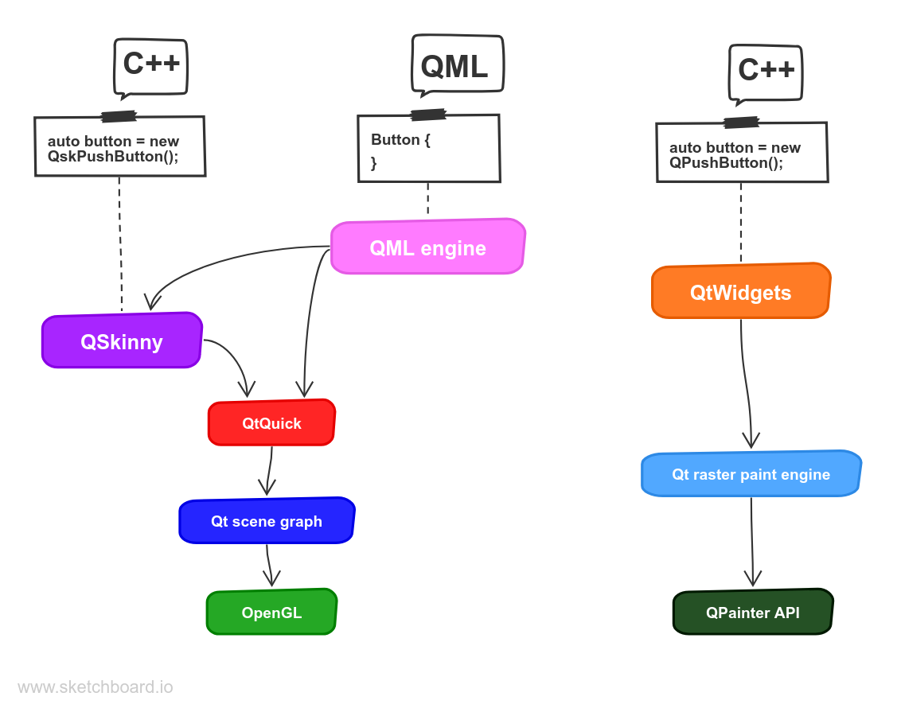
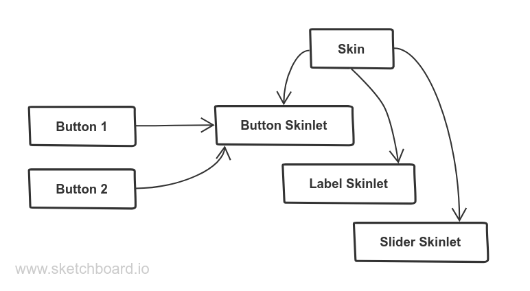

theme: QtDay 2019
footer: 


# [fit] QSkinny - A new approach
# [fit] for a QtQuick framework

^ 3 sections in this talk: Why, What and How (Is this yet another set of controls?)

---

# Who am I?

- working on Qt since 2008
- former QtNetwork maintainer
- [@peha23](https://twitter.com/peha23) on Twitter
- founder of [edelhirsch.io](https://www.edelhirsch.io)

^ I'm not the founder of QSkinny though

---


image © AGCO GmbH

^ IC, 2 screens on Embedded Linux, one Android tablet that is also running QSkinny
^ QSKinny is not a proof of concept or study, but it is going into production as we speak. 
^ Unfortunately we cannot show more; you can see more at Agritecnica

---

# [fit] Why
# [fit] QSkinny?

---

# Why create QSkinny?

- performance / memory usage
- freedom of choice between QML / C++ (including pure C++)

^ performance (1): TQC: replacing QML with C++ in controls (QQC1 -> QQC2). Same solution is true for application code. let programmer decide what to write in QML and what in C++. We're going to see later: QQC2 are not really extensible (QQuickControl class is private).
^ performance (2): startup, memory, property binding changes (deferred updates etc.). Quite some work on QML is going into making it faster (QML compiler, direct binding etc.). With C++/QSkinny there is not much overhead to begin with.
^ performance (3): memory / startup usage (see example); property bindings overhead, also with e.g. nested layouts
^ C++ no bridging to QML needed, tooling (address sanitizers, refactoring, other IDEs except QtCreator, auto test coverage, static code checkers), debugging etc., personal preference. Quite some work from the Qt Company is going into tooling for QML; I wonder whether it can achieve that good tooling. With C++ you get this for free, also 100% code checking with sanitisers etc. is a good thing.

^ ... as in: Why was it created?
^ Qt 5.3: V4 not fast enough
^ team background: QtWidgets and C++; QML was new
^ QtQuickControls 1: performance issues (all in QML, now deprecated)
^ QQC2: solution was to use C++ => too much QML can easily be a problem for performance.
^ QtQuickControls 2: not extensible (font, palette, locale / some of its logic is in QML)
^ => try how far you can get with own framework
^ QML is just more high level abstraction

---

# Why use QSkinny?

- public C++ API
- usable from QML
- runs with Qt >= 5.6

^ QSkinny and QML are not mutually exclusive, programmer can decide how much of each he/she wants (including no QML)
^ mix and match C++/QML
^ LGPLv2: works with Qt 5.6; not much new on the C++ side (except Vulkan / shapes). The tractor UI shown before is using QSkinny on top of Qt 5.6.
^ QSkinny is free software (LGPLv2; maybe MIT/BSD in the future). When using eglfs: Qt 5.6 works well, and LGPLv2 can be used. Also, when only using C++ part (not QML), after 5.6 there wasn't that much new (exception: Vulkan / Metal etc. backends).
^ However: It is not a general purpose toolkit yet, many controls were created to match the use case of the project.

---

# [fit] What
# [fit] is QSkinny?

---

### A lightweight framework on top of the Qt scene graph



^ Qsk / SG: synchronisation points, QtWidgets doesn't have those
^ raster paint engine: There is also X11 paint engine and in Qt4 OpenGL paint engine

---

# API example

```c++
    auto button = new QskPushButton("push me");
    auto label = new QskTextLabel("label");

    auto box = new QskLinearBox(Qt::Vertical);

    box.addItem(button);
    box.addItem(label);

    QskWindow window;
    window.addItem(box);
    window.show();
```

^ ### leave Window out? Add QML equivalent? ggf. screenshot or show program?

---

# [fit] How
# [fit] does QSkinny work?

---

### separation of implementation and styling: classes



^ AGCO: more flexibility wrt. styling, not only colours and metrics, but also handles etc. example checkbox: Haken vs. switch; hard to do in QML
^ in addition there are hints (e.g. colors, metrics etc.) that are like properties
^ theming: 2 Stufen: 1. metrics / colors / animations, 2. Skinlets (delegates)
^ TQC also thinks about styling in C++
^ styling is extensible

---

## separation of implementation and styling: flow


^ here show mycontrols example (including overlay modus)

---

# example: QSkinny page indicator

```
--- user code:

auto* pageIndicator = new QskPageIndicator();
pageIndicator->setCurrentIndex( 0 );
pageIndicator->setCount( 5 );

--- internal:

for ( int i = 0; i < indicator->count(); i++ )
{
    bulletNode = new QskBoxNode();
}
```

---


---

# example: QML page indicator

```
--- user code:

PageIndicator {
    currentIndex: 0
    count: 5
}

--- internal:

T.PageIndicator {
    delegate: Rectangle {
    }
}
```

^ each bullet is one QQuickItem (fine for page indicator, but think e.g. gradient stop or list view etc.)

^ QskPageIndicator: one QObjects, one scene graph node per bullet; derives from QQuickItem; method above is called from updatePaintNode

---


---

# Thanks!

[https://github.com/uwerat/qskinny](https://github.com/uwerat/qskinny)

[peter@edelhirsch.io](mailto:peter@edelhirsch.io)
[support@qskinny.org](mailto:support@qskinny.org)

^ Again: Not to bash QML, but some constructive criticism is in order. The UI written with QSkinny is blazingly fast and is going into production soon, so another way is definitely possible.
^ every QML project I worked on so far showed performance problems (startup / memory usage (especially multi-process) / loading QML components with Loaders).
